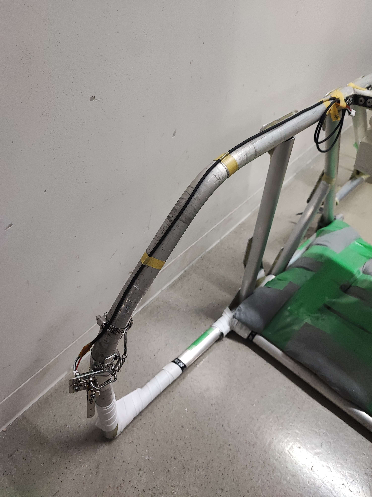
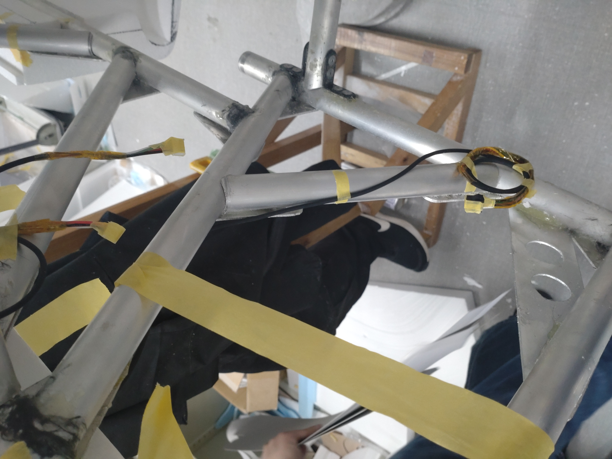
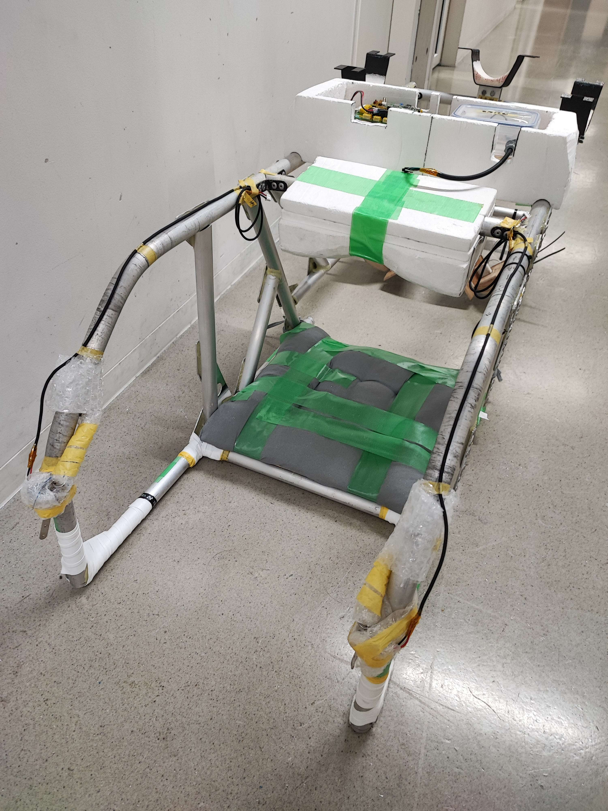

# コクピ事前準備
- コクピフレームへの基盤・ケーブル配置  
 以下のものとケーブルが取り付けられていることを確認する(ケーブルはフレームにマステで固定する)
  - スピーカー
    - スピーカー・スピーカーケーブル
    - パイロット保護の観点から緩衝材をつけておく  
  <img src="images/スピーカー配置場所.JPG")
  - 操舵
    - 操縦桿×２(フレーム前方に操縦桿用のホースバンドを使って固定)
    - 操縦桿用ケーブル×2(操縦桿のコネクタに挿した状態でフレームに沿ってつける)
    - 操縦桿にはパイロット保護から緩衝材を巻く
  
  - 機体下
    - 機体下電装部フレーム中継ケーブル  
  
  - エアデータ(コクピ内での準備は無し)
    - ベーンを取り外して3Dモデルを入れている箱に本番機で使うのと分かるようにしるしをつけてしまう
    - パイプは段ボールの中にしまう
  - メイン電装部の組み立て
    - 基板が板にねじ止めされているかを確認する(ゆるみがないか)
    - アンテナが板にしっかり固定されており，ゆるみがないか確認する
  - メイン電装取り付け(湖岸についてからピトー管を取り付けるために一度取り外すので固定はしない)
    - コクピフレーム内に取り付ける
   
- 各ケーブルはメインには接続しない(湖岸についてからメインを取り外すため) → 写真のようにしておく

- 各コンポーネントにフォーマットしたSDを取り付ける

- 完成系

    

